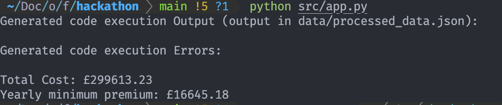

# FetchAI Hackathon - Team 3

### Setup instructions

1. If you haven't, install Poetry with `pipx install poetry`
2. Then, run `poetry install` and after that `poetry shell`. The latter makes the terminal use the Poetry virtual environment. This is important in order to avoid `ModuleNotFoundError` errors
3. Rename `.env.sample` to `.env` and replace "YOUR_KEY" with an OpenAI API token

### Run uAgents prototype

#### 1. Start all three agents

Open three terminal tabs and start the three agents:

1. `python src/agents/extraction.py`
2. `python src/agents/rules_generator.py`
3. `python src/agents/recommendations.py`

In a 4th terminal tab, start the webserver by

```bash
python src/server.py
```

The webserver has one endpoint, `/api`. This can be triggered using Curl

```bash
curl http://127.0.0.1:5000/api
```

The output for now should be a dictionary with the total premium cost and the yearly premium cost for the included Pension Benefits Scheme doc and the employees data.

## Debugging

The prototype can also be tested or ran without the uAgents framework. Just run the following in the project root:

```bash
python src/app.py
```

This should produce the same output as the API above.
For example: 
To see the code that is dynamically generated and executed based on the provided employees data and Pension Benefit Scheme, head over to `src/temp.py`.
The output of this execution is placed in `data/processed_data.json`. Both files can be inspected and possibly debugged.
The ChatGPT prompt responsible for creating the temp.py file is located in the `src/prompts` folder.

The result in `processed_data.json` is ultimately used in the recommendation step for computing the insurance premium price.
